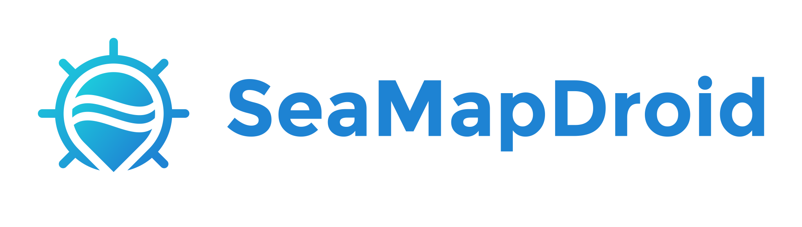
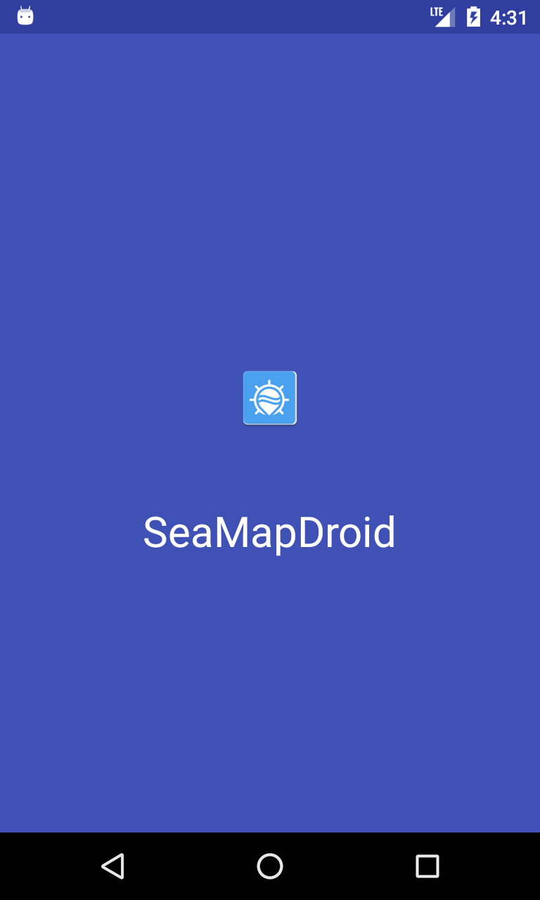
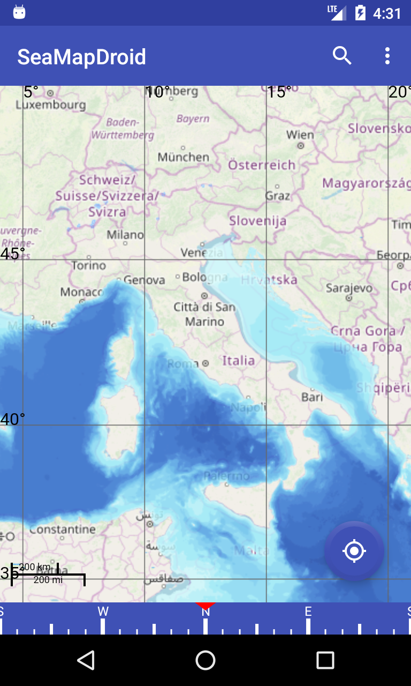
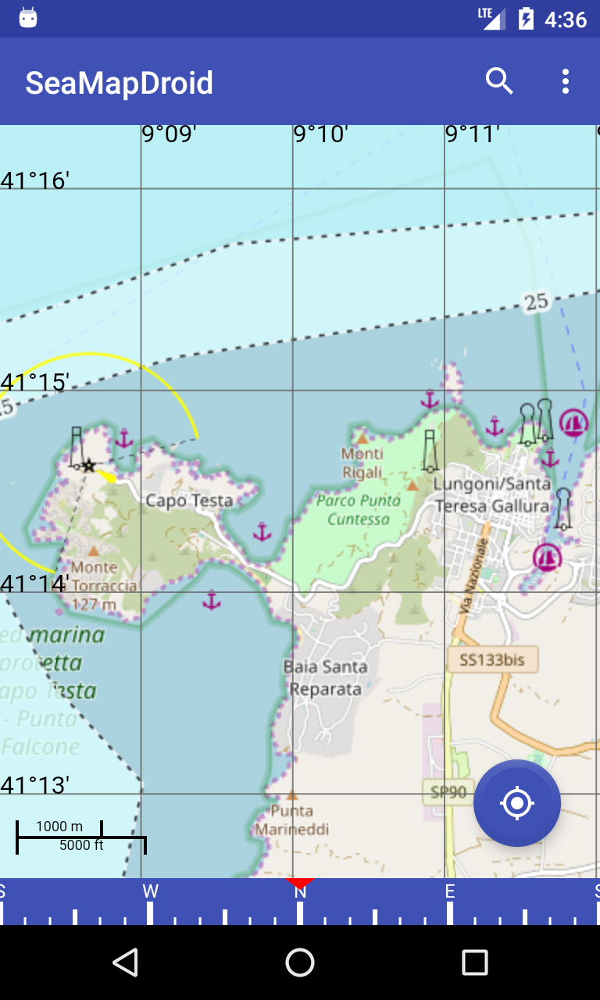

SeaMapDroid
===========
An open source Android  application for consult the libre online nautical maps OpenSeaMap (map.openseamap.org).

Screenshots
-----------

Features
--------
* Different languages: Italian, English, Russian
* Many layers displayed on the map
* User GPS route track
* Free-software

Translations
------------
For adding a new language is necessary add a new version of strings.xml file with the new translation

#### Get the source

    $ git clone https://github.com/marcoM32/SeaMapDroid.git
    $ cd SeaMapDroid

License
-------

This application is Free Software: You can use, study share and improve it at your
will. Specifically you can redistribute and/or modify it under the terms of the
[GNU General Public License](https://www.gnu.org/licenses/gpl.html) as
published by the Free Software Foundation, either version 3 of the License, or
(at your option) any later version.

Contribution
-------
Logo by [@naufaldsg](https://github.com/naufaldsg/)
